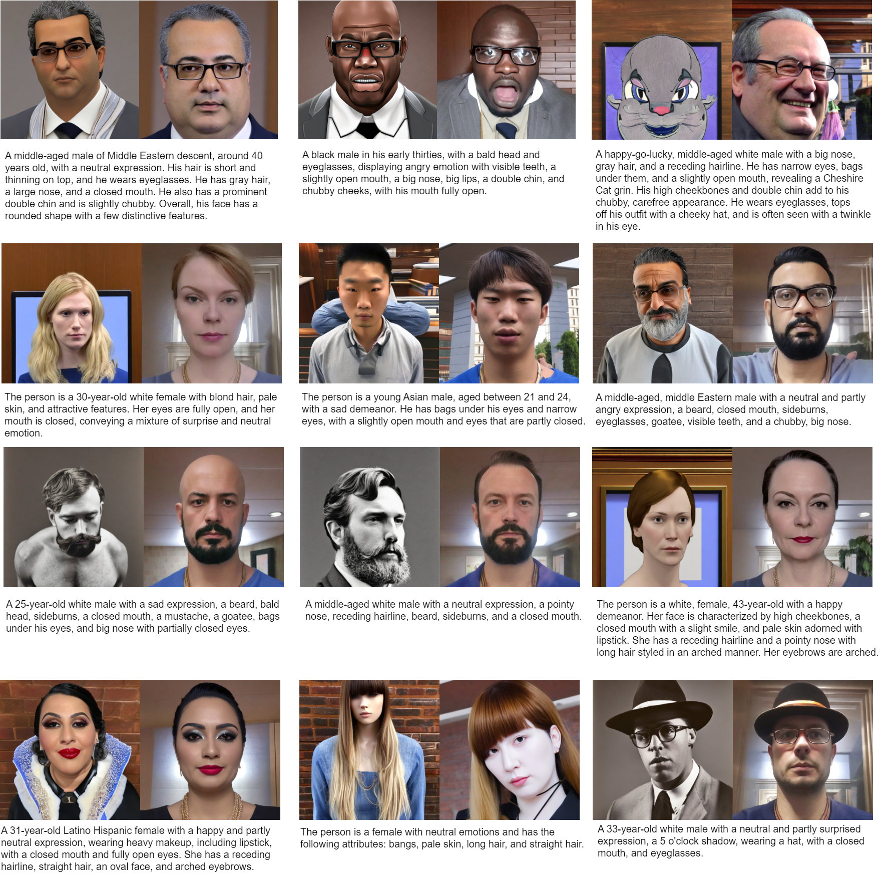

# Text2Face-LoRa


This repository provides the code for a LoRa-finetuned version of the Stable Diffusion 2.1 model specifically optimized 
for generating face images. The package includes both training and inference capabilities, along with a pretrained model 
and the synthetic annotations used for finetuning. Some examples comparing our model (right) with SD2.1 base model (left) are presented below.



## Features
- **Pretrained Model:** `download.py` downloads our pretrained model from Hugging Face.
- **Inference Script:** `generate.py` Ready-to-use script for generating images using the pretrained model.
- **Finetuning Script:** `finetune.py` applies LoRa adjustments to both the UNet denoiser and the text encoder of Stable Diffusion.

## Environment Setup
Set up a conda environment to run the model using the following commands:
```bash
conda create -n text2face
conda activate text2face

## Install requirements
pip install -r requirements.txt
```

## Checkpoints
You can download the pretrained LoRa weights for the diffusion model and text encoder using our provided Python script `download.py`

```bash
python download.py
```
## Inference
Generate images using the `generate.py` script, which loads the SD2.1 foundation model from Hugging Face and applies the LoRa weights. 
Generation is driven by defining a prompt and optionally a negative prompt.

## Datasets
The provided checkpoint was finetuned with [FFHQ](https://github.com/NVlabs/ffhq-dataset) and [easyportrait](https://github.com/hukenovs/easyportrait) 
using synthetic text captions for both datasets. 
Synthetic captions for these datasets and a subset of [LAION-Face](https://huggingface.co/datasets/FacePerceiver/laion-face), which includes high resolution face crops, can be found in the links below.

| Dataset       | # Images | captions |
|:--------------|------:|---------:|
| Easy Portrait         |  39k |       [google drive](https://drive.google.com/file/d/1GAYPxtn9a6M8syj_rmiQUU9qFWYJjKX0/view?usp=drive_link) |
| FFHQ        |  70k |       [google drive](https://drive.google.com/file/d/12UlvshHY42S1hA3pj6uYDIyx5HbAzT-G/view?usp=drive_link) |
| LAION-Face        |  156k |       [google drive](https://drive.google.com/file/d/1qNw9WgV_QaxZ-OKtNYpGNm4vmBNGaNsG/view?usp=drive_link) |


## Finetuning
Use `finetune.py` to finetune a stable diffusion model using LoRAs for the UNet denoiser and the text encoder. 
Example command for training:

```bash
accelerate config
accelerate config default

export MODEL_NAME="stabilityai/stable-diffusion-2-1"
export TRAIN_DIR="<root dir for training data>"

accelerate launch  finetune_lora.py --pretrained_model_name_or_path=$MODEL_NAME   \
--train_data_dir=$TRAIN_DIR   \
--train_text_encoder   \
--checkpointing_steps 5000   \
--resolution=768   \
--center_crop   \
--train_batch_size=4  \
--num_train_epochs 20   \
--gradient_accumulation_steps=1  \
--gradient_checkpointing  \
--num_validation_images 5  \
--learning_rate=1e-05  \
--learning_rate_text_encoder=1e-05 \
--max_grad_norm=1  \
--rank 8  \
--text_encoder_rank 8 \
--lr_scheduler="constant" \
--lr_warmup_steps=0  \
--output_dir="<output directory for trained model>"  \
--resume_from_checkpoint "latest" \
--validation_prompts "A young Latina woman, around 27 years old, with long hair and pale skin, expressing a mix of happiness and neutral emotions. She has fully open eyes and arched eyebrows." "The person is a 44-year-old Asian male with gray hair and a receding hairline. He has a big nose, closed mouth and is feeling a mix of anger and sadness." "A Latino Hispanic male, 22 years old, with straight hair, an oval face, and eyes fully open. His emotion is sad and partly neutral." "A white male, 28 years old, with a neutral emotion, sideburns, pale skin, little hair, an attractive appearance, a 5 o'clock shadow, and pointy nose." "A young, black, female individual with an oval face and big eyes, with a happy and partly surprised expression."
```

## Limitations

This model, Text2Face-LoRa, is finetuned from Stable Diffusion 2.1 and as such, inherits all the limitations and biases 
associated with the base model. These biases may manifest in skewed representations across different ethnicities and 
genders due to the nature of the training data originally used for Stable Diffusion 2.1.

### Specific Limitations Include:

- **Ethnic and Gender Biases**: The model may generate images that do not equally represent the diversity of human 
features in different ethnic and gender groups, potentially reinforcing or exacerbating existing stereotypes.

- **Selection Bias in Finetuning Datasets**: The datasets used for finetuning this model were selected with specific 
criteria in mind, which may not encompass a wide enough variety of data points to correct for the inherited biases of the base model.

- **Caption Generation Bias**: The synthetic annotations used to finetune this model were generated by automated 
face analysis models, which themselves may be biased. This could lead to inaccuracies in facial feature interpretation 
and representation, particularly for less-represented demographics in the training data.

### Ethical Considerations:

Users are encouraged to consider these limitations when deploying the model in real-world applications, especially 
those involving diverse human subjects. It is advisable to perform additional validations and seek ways to mitigate 
these biases in practical use cases.


